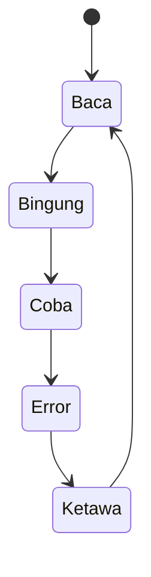

<p align="center">
  
</p>

<p align="center">
  <a href="https://github.com/ganezha/ganezha/actions/workflows/typecheck.yml"></a>
</p>

Saya lebih senang **belajar** daripada **pintar**.  
Kalau error: ketawa dulu. Baru beresin.

The compiler is strict. I am not.

---

## identity

Sumber kebenaran ada di [`profile.ts`](./profile.ts).  
Setiap push dicek `tsc --strict`. Kalau badge ini merah, berarti saya sedang jujur.

```ts
export const ganezha = {
  name: "Ganezha",
  prefers: "belajar",
  avoids: "terlihat pintar",
  mode: "learning",
} as const satisfies Ganezha;
```

`satisfies` biar tipenya yang ngawasi saya.  
`as const` biar saya tidak ganti cerita di tengah jalan.

## loop



Ilmu bukan harta; ia air yang mengalir.

## now

Building in public: [**KOTAK kecil**](https://github.com/ganezha/kotak-kecil) — kotak perkakas MIT.  
Tool pertama: [`han.sip`](https://github.com/ganezha/kotak-kecil/tree/main/han.sip) — ronda malam untuk git.

## stack

```
javascript   shipping small tools
node         scripts, bots, kesalahan yang sudah jadi pelajaran
git          masih googling rebase, dengan damai
web3         penasaran, bukan guru
```

## contract

- Public by default, MIT
- One repo, one job
- No secrets in git
- Issues and PRs welcome — saya belajar dari yang lebih telaten
